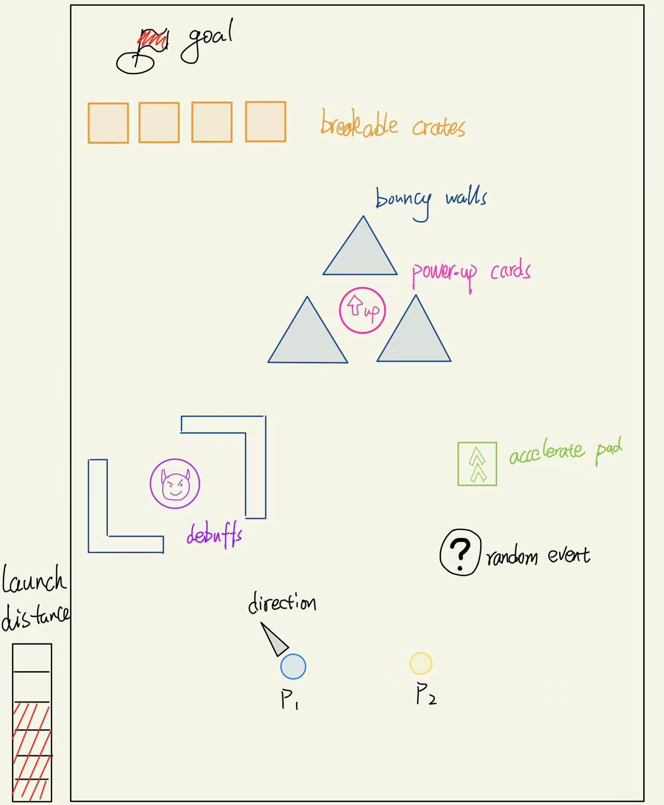

# Golf Simulator Game -- CS269J 2022
Golf simulatior game project group for CS269

Team members:

* Li, Xinlai "Peter"
* Su, Yiheng
* Wang, Blitzen
* Ren, Ashley
* Zhang, Chloe

### Name of Game: Hole-in-one

Designed by Blitzen Wang

1. Overview  
Hole-in-One is a 2D simulation game where two players compete by trying to launch their ball into a hole. Each player is represented as a golf ball, and their main objective is to traverse through a level filled with obstacles, and interactable terrains, and items in order to reach the goal. 
2. Gameplay  
    2.1 Gameplay loop  
	+ Gameplay revolves around turn-based action where the two players take turns moving their own ball and using items. At the start of the game, the two players are placedin their initial position, and a goal, represented as a circular area, will appear on the other side of the leve. At the start of each turn, a player can choose to use an item in their inventory and then select a direction and the amount of force applied to launch their ball. After a player launches their ball, the controls are passed to the other player.  
	
    2.2 Win Condition  
	+ When either player's ball hits the goal, that player gains a point, and the goal will then relocate on the other side of the level. The first player that reaches 3 points wins the game.

	
3. Mechanics  
    3.1   

4. User Interface  

5. Aesthetics  
